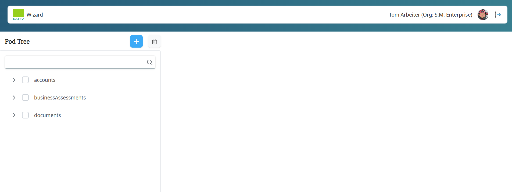
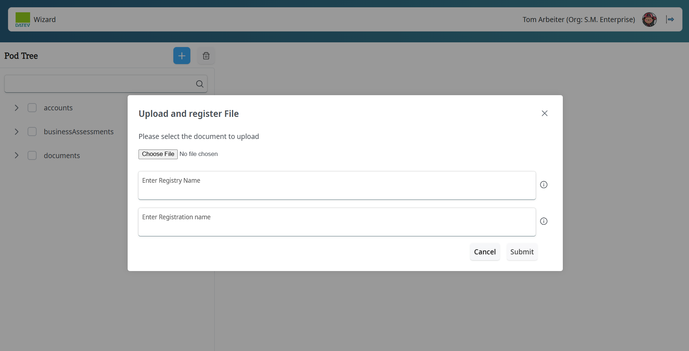
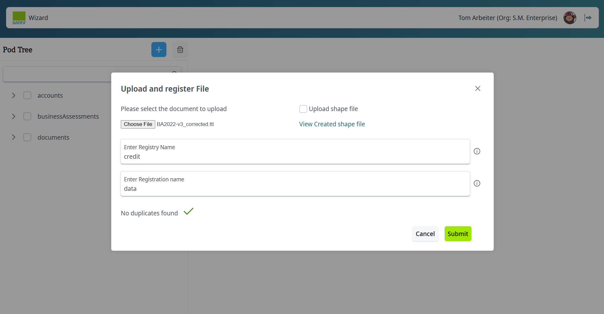
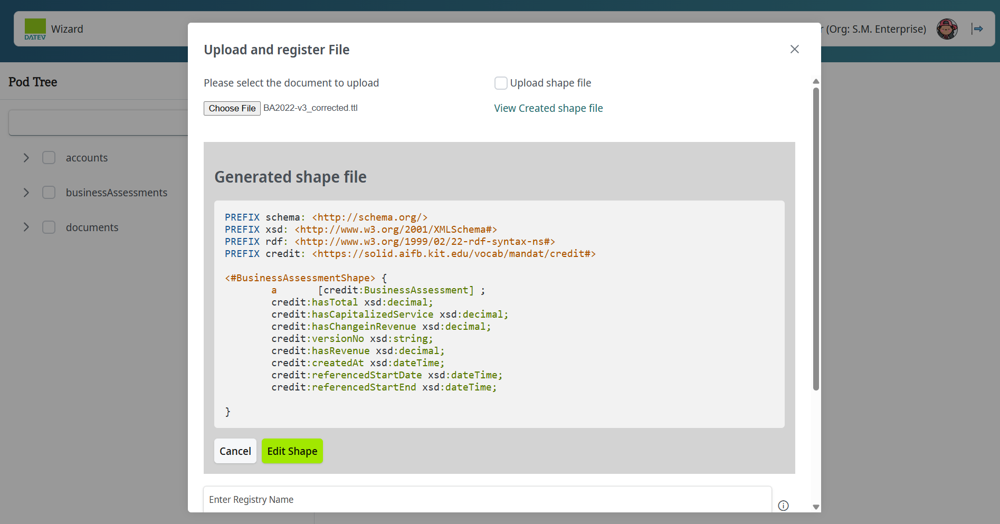
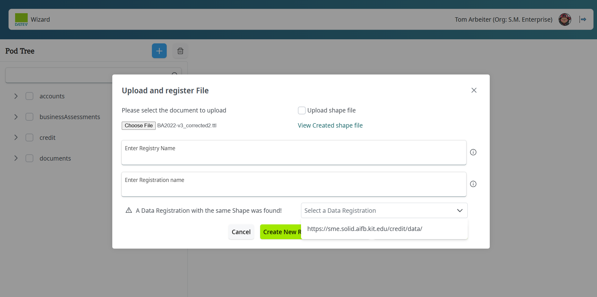
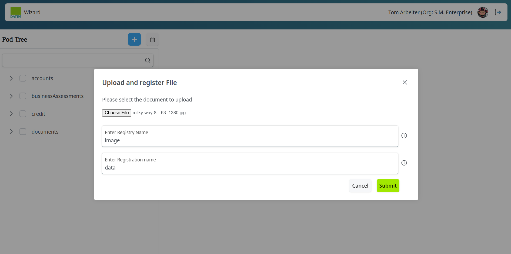
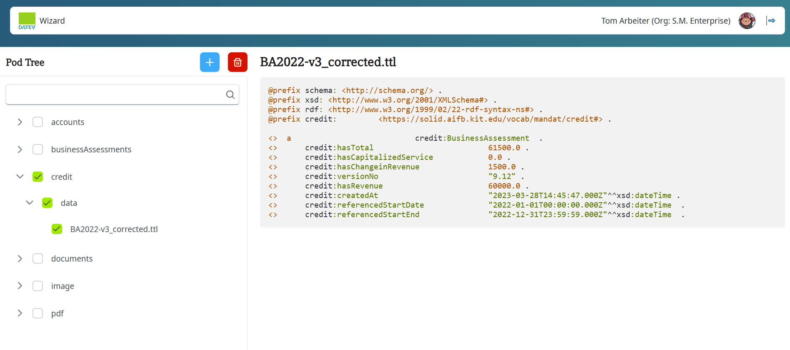
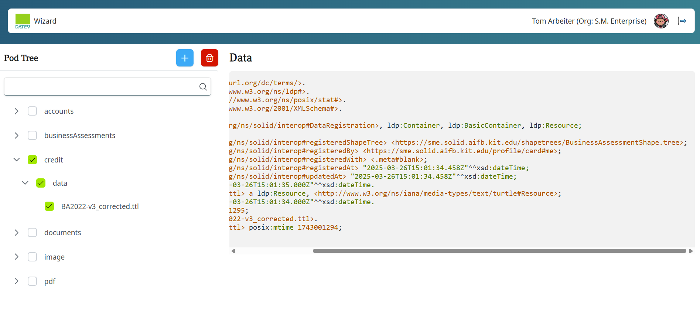
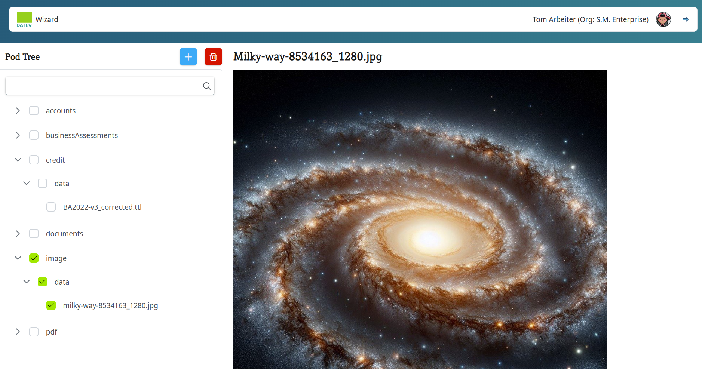
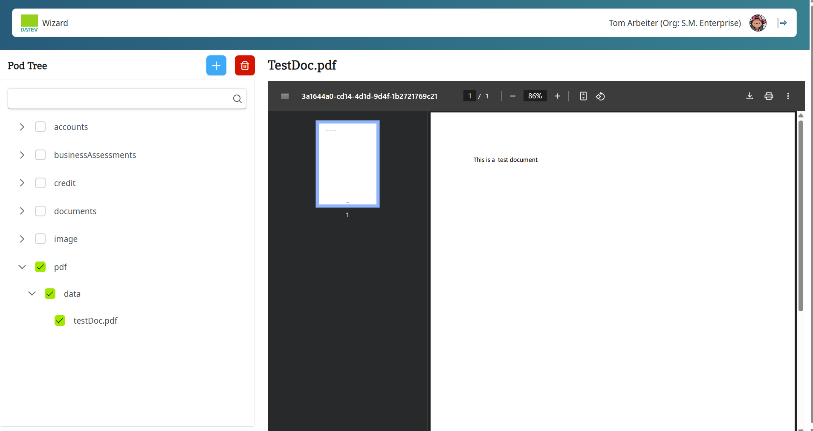

# Solid Data Wizard Documentation

## Overview

The Solid Data Wizard is an application designed to manage data registrations and 
registries using Solid Pods. It provides a user-friendly interface for creating and 
managing data registrations and check for duplicate shape files for the turtle file. 

## Features

+ **Create Data Registrations:** Allows users to create new data registrations.
+ **Check for Duplicates:** Automatically checks for duplicate data registrations.
+ **Manage Registries:** Provides options to manage and select data registries.
+ **Document Upload:** Allows users to upload documents to their data registrations.
+ **Registration View:** Provides a tree view of data registrations.
+ **Delete Registry/Registration/Document:** Provides the functionality to delete the registry, registration or the uploaded document.

## Prerequisites

+ Node.js (v16.19.0)

## Installation

+ Clone the repository:
<pre>
git clone https://github.com/DATEV-Research/Solid-B2B-showcase.git 
cd Solid-B2B-showcase/apps/wizard 
</pre>

+ Install dependencies:
<pre>npm install </pre>

## Project Structure
<pre>
solid-data-wizard/
├── apps/
│   ├── wizard/
│   │   ├── src/
│   │   │   ├── components/
│   │   │   ├── utils/
│   │   │   ├── App.vue
│   │   │   ├── main.ts
│   │   │   ├── ...
├── node_modules/
├── package.json
├── README.md
└── ...
</pre>

+ **src/:** Contains the source code of the application.
+ **components/:** Contains Vue components.
+ **utils/:** Contains reusable functions.
+ **node_modules/:** Contains project dependencies.
+ **package.json:** Project configuration and dependencies.

## Usage

+ Start the development server:  
<pre>npm run serve </pre>
+ Open the application in your browser at http://localhost:8080.

## Development

### Creating a New Component
+ Create a new file in the src/components/ directory.
+ Define the Vue component in the new file.

### Creating a New View
+ Create a new file in the <pre> src/views/</pre> 
+ Define the Vue view in the new file.

## Application

### 1. Default View
The default view of the Solid Data Wizard application is shown below. The view contains the list
of data registrations and options to create new data registrations and manage registries.

### 2. Create Data Registration
The Create Data Registration view allows users to create new data registrations. Users can enter 
the details of the data registration, data registry  and upload a document.

### 3. Uploading Turtle File
Users can upload a Turtle file to create a new data registration. The Turtle file should be valid. <a href="https://felixlohmeier.github.io/turtle-web-editor/" target="_blank" >Online Turtle File Validator</a>.

If the turtle file is valid, the shape file will be created. The user can view the created shape file
by clicking on the "View created shape file" button. User can also edit and save the shape file.

User also have the option to upload the Shape File directly. The Shape File should be valid. <a href="https://rawgit.com/shexSpec/shex.js/main/packages/shex-webapp/doc/shex-simple.html" target="_blank" >Online Shape File Validator</a>.

User can enter the registry and registration name and submit the form. The data registration will be created.

#### 3.1. Uploading Turtle File with shape File present in the pod

Once the turtle file is uploaded, the script will check if any shape file present in the 'shapetrees' folder in the pod.
The view will show the registry path to the user and ask if the user wants to use the shape file present in the pod.

While the compression of the shape file is running user also have the option to skip the compression process.
User also have a option to create a new Registry.
### 4. Uploading PDF or image file

User can upload a PDF or image file to create a new data registration. 

### 5. Uploaded documents view

#### 5.1. Turtle File View

Registration RDF data view linked with the shape Tree file.

#### 5.2. Image File View

#### 5.3. Image File View

